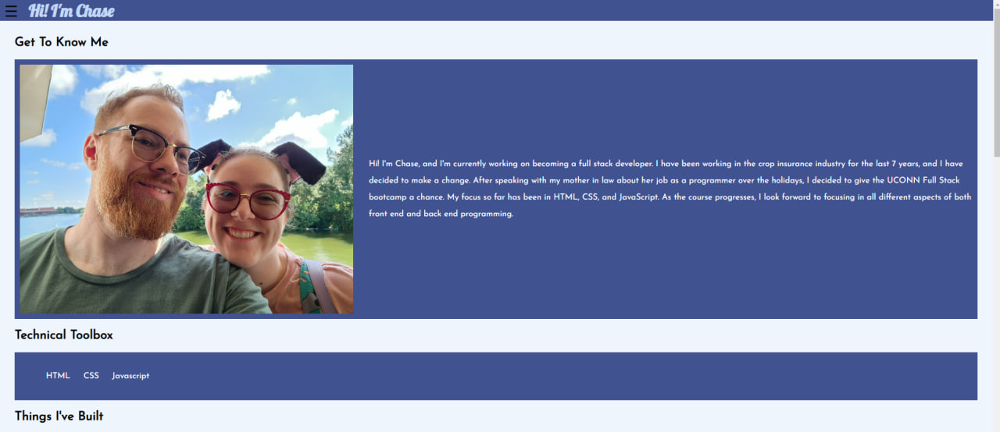

# <Your-Project-Title>

## Description

This website is my Fullstack Portfolio, displaying my use of HTML,CSS, and JavaScript. It is also a place for me to host my projects so others can view and access them.

- This portfolio was designed to put all my information in one easily accessible place to
  assist me in getting hired by future employers.
- With this project, I was able to work on my HTML and CSS designs, along with implementing a workflow and design on large and small screens.

## Installation

You can access the website through this link:

https://chasechambers.github.io/Chase-Chambers-Web-Portfolio/

## Usage

## Credits

- The JavaScript sidebar was created with use of a tutorial found here: https://www.w3schools.com/howto/tryit.asp?filename=tryhow_js_sidenav
- Style, design, and coding elements were discussed and reviewed with Rachel Croteau (No github available).
- Research was done on websites such as W3 Schools and MDN.
- Font choices assisted with by Nancy Chambers (No github available).

## License

## Features

The side bar button expands and allows you to move down the page. A link at the bottom allows you to move back to the top of the page.
